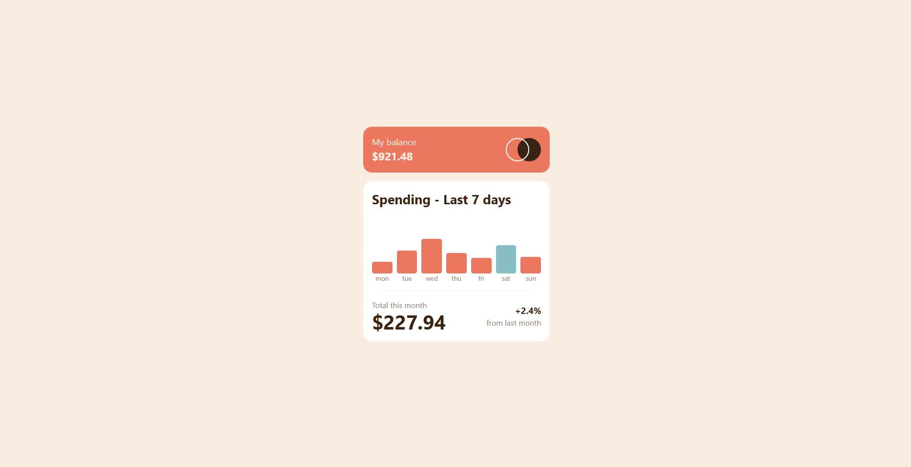

# Frontend Mentor - Expenses chart component solution

This is a solution to the [Expenses chart component challenge on Frontend Mentor](https://www.frontendmentor.io/challenges/expenses-chart-component-e7yJBUdjwt). Frontend Mentor challenges help you improve your coding skills by building realistic projects. 

## Table of contents

- [Overview](#overview)
  - [The challenge](#the-challenge)
  - [Screenshot](#screenshot)
  - [Links](#links)
- [My process](#my-process)
  - [Built with](#built-with)
  - [Continued development](#continued-development)
  - [Useful resources](#useful-resources)
- [Author](#author)

## Overview

### The challenge

Users should be able to:

- View the bar chart and hover over the individual bars to see the correct amounts for each day
- See the current day’s bar highlighted in a different colour to the other bars
- View the optimal layout for the content depending on their device’s screen size
- See hover states for all interactive elements on the page
- **Bonus**: Use the JSON data file provided to dynamically size the bars on the chart

### Screenshot

### Links

- Solution URL: [Frontendmentor ](https://www.frontendmentor.io/challenges/expenses-chart-component-e7yJBUdjwt)
- Live Site URL: [Github pages](https://www.frontendmentor.io/challenges/expenses-chart-component-e7yJBUdjwt)

## My process

### Built with

- Semantic HTML5 markup
- CSS custom properties
- Flexbox
- CSS Grid
- Mobile-first workflow
- Javascript
- Fetch
- [React](https://reactjs.org/) - JS library
- [Tailwind](https://tailwindcss.com) - CSS framework
- [typescript](https://www.typescriptlang.org) - superset of JavaScript

### Continued development

I was thinking in further develop this one, maybe a litle backend an actualy use it to track my spences.

### Useful resources

- [React.js](https://reactjs.org/)
- [Tailwind](https://tailwindcss.com)
- [Typescript](https://www.typescriptlang.org)

## Author

- portfolio - [Github pages](https://luisortega27.github.io/portfolio/)
- Frontend Mentor - [@LuisOrtega27](https://www.frontendmentor.io/profile/LuisOrtega27)
- Github - [LuisOrtega27](https://github.com/LuisOrtega27)